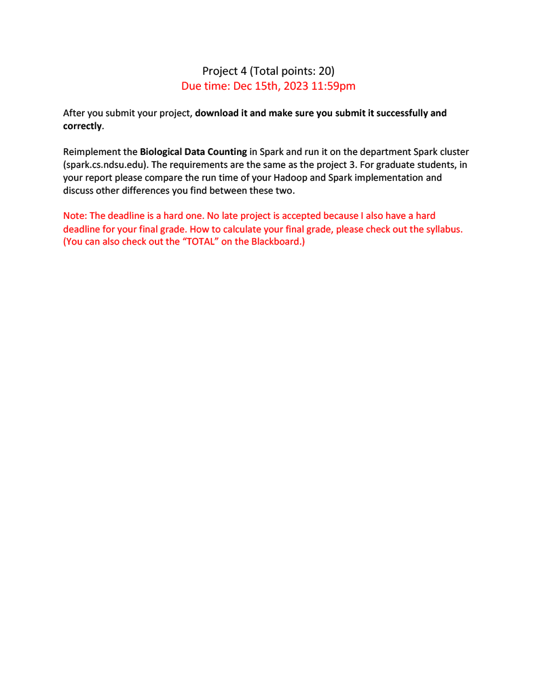

# CSCI-455-Project-4
This project is about programming for Spark and running it on a Spark server.

If you want to what I had to code for this project you can check out my [project 3](https://github.com/brandon57/CSCI-455-Project-3)

# These are the requirements for the project
<p align="center">
  
</p>

# Getting Started

In order to run this you have to have a Spark server running.
In this case I'll be using the Spark server that NDSU has called spark.cs.ndsu.edu.

## Uploading files
Once you have that you'll need to upload the java package and the input file to the server. To do that you can use either [FileZilla](https://filezilla-project.org/) or [WinSCP](https://winscp.net/eng/index.php) to connect to the server through SFTP

## Setup
Now that all the files are transfered over we'll need to do a few things before we can run the program.

### Connecting
First you'll need to connect to the server through SSH. To do this you can either use a software call [PuTTY](https://www.putty.org/)
or you can use the terminal, command prompt or powershell to connect to the server.

### Compiling java files
Now that you are connected and have transfered over the java package we now need to compile the java files so that we can actually run the program.

* First we'll need to navigate to the java package
```
cd main/
```

* Next we need the class files from each java file:
```
javac -classpath /usr/lib/spark-3.1.1-bin-hadoop3.2/jars/spark-core_2.12-3.1.1.jar:/usr/lib/spark-3.1.1-bin-hadoop3.2/jars/spark-sql_2.12-3.1.1.jar:/usr/lib/spark-3.1.1-bin-hadoop3.2/jars/scala-library-2.12.10.jar Spark.java Table.java InteractionsMap.java
```

* Then we'll go to the main directory:
```
cd
```

* Next we'll create a jar file with the class files we just created:
```
jar -cvf Spark.jar ./main/*.class
```

# Running The Program
Now that we have the jar file we can now run the program.

To run it we'll use this command:
```
spark-submit --class main.Spark --master local ./Spark.jar ./interactions
```
After running this command the program will run.

Once the program is done running there will be a folder called output that appears in your directory that contains 2 files. 
To see what the files read you need to first see what each file's name is

First we'll change the directory to the output folder:
```
cd output/
```
Next we'll run this command. This command will list out all the files inside the directory:
```
ls -l
```
The output should look like this:
```
total 2044
-rw-r--r-- 1 brandon.sitarz student 2091124 Dec 15 16:49 part-00000
-rw-r--r-- 1 brandon.sitarz student       0 Dec 15 16:49 _SUCCESS
```
Note: The file with the name `part-*` is the one with the output

Now to read the file you can run this command:
```
cat part-00000
```

The output should look similar to this:
```
brandon.sitarz@spark:~/output$ cat part-00000
(20161, 20534)  1
(6380, 6635)  1
(6078, 6397)  1
(731, 2140)  1
(23989, 23991)  1
(2577, 2866)  1
(6823, 6823)  35
(20403, 20405)  1
(2608, 3847)  1
(969, 970)  2
(27598, 27599)  6
(8507, 8508)  4
(20915, 21716)  1
(5485, 6103)  1
(237, 370)  1
(24102, 24494)  1
(8288, 8407)  1
(4131, 4142)  1
(4308, 4308)  10
(14711, 15303)  1
```
